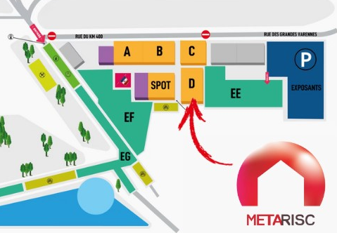

**Metarisc au Congrès National des Sapeurs-Pompiers 2024 : Venez découvrir notre solution innovante !**

Nous avons le plaisir de vous annoncer la participation de Metarisc au [Congrès National des Sapeurs-Pompiers 2024](https://congres2024.pompiers.fr/), qui se tiendra à Mâcon du 25 au 28 septembre 2024. Ce rendez-vous incontournable rassemble les acteurs majeurs du domaine de la sécurité civile et représente une opportunité unique pour échanger autour des dernières innovations en matière de gestion des risques.

**Pourquoi venir nous rencontrer ?**

- **Découvrir Metarisc en action** : Assistez à des démonstrations en direct pour voir comment notre solution peut répondre aux défis quotidiens des SDIS.
- **Échanger avec nos experts** : Nos équipes seront présentes pour répondre à toutes vos questions et vous accompagner dans la compréhension de l’application et du projet.
- **Personnaliser votre expérience** : Nous vous offrons la possibilité de réserver un créneau pour une présentation individuelle de notre logiciel. Pour réserver votre créneau, rendez-vous sur notre plateforme de réservation en ligne : [Réserver un créneau](https://fr.resaclick.net/metarisc).

**Un lieu d'échange et d'innovation**

Le Congrès National des Sapeurs-Pompiers est bien plus qu'une simple exposition ; c'est un lieu d'échange, d'apprentissage et d'innovation. Nous sommes impatients de partager avec vous notre vision pour l'avenir de la gestion de la présentation et la prévision des risques et de vous montrer comment Metarisc peut devenir un outil indispensable dans votre quotidien.

**Ne manquez pas cette occasion unique** de rencontrer nos équipes et de découvrir comment Metarisc peut transformer vos pratiques. Que vous soyez déjà utilisateur de notre solution ou simplement curieux d'en savoir plus, nous serons ravis de vous accueillir sur notre stand.

  

**Informations pratiques**
- **Dates** : Du 25 au 27 septembre 2024
- **Lieu** : Parc des Expositions de Mâcon, France
- **Stand Metarisc** : Hall D

**À très bientôt !**
